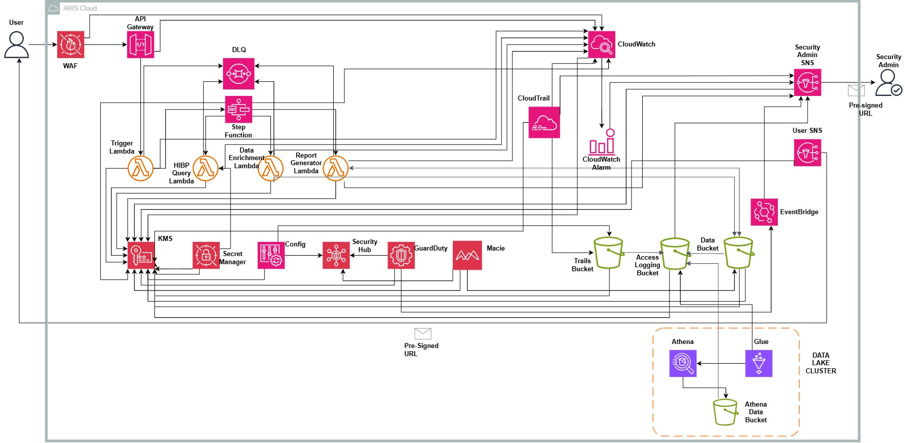

# Breach Intelligence Aggregator 

A serverless project designed to query HaveIBeenPwned for email and domain credential exposures using an API key and a provided email and domain and return processed records back to the requester and security admin while storing them for future analysis.

Built as a cloud security engineering portfolio project demonstrating AWS security architecture, infrastructure-as-code, Boto3 scripting and DevSecOps practices.

---

## Problem Statement

Billions of credentials are exposed annually across thousands of breaches. This project helps startups and individuals query their credential exposure and store the data for long-term retention and analysis using a paid API key.

This project demonstrates getting the breaches for emails and domains securely from HaveIBeenPwned, processing these breaches and sending back structured breach intelligence reports while storing the pre-processed and post-processed records within a KMS-encrypted S3 bucket with lifecycle management for data persistence and Glue-powered data lake for ad-hoc analysis.

This project is directly relevant to GDPR Article 33, which requires organizations to notify their supervisory authority within 72 hours of discovering a personal data breach. A tool that rapidly surfaces credential exposures supports that obligation.

---

## Architecture



---

## How It Works

The User passes in the paid API Key from HaveIBeenPwned which is stored within Secrets Manager and an email where the processed breach data reports are sent. Security admin email is also requested as well. CloudTrail, GuardDuty findings, Data Report and a CloudWatch alarm is configured to send alerts to the Security Admins email using the SNS Admin Topic.

After Terraform has created all the resources, the user is given the API Gateway endpoint as an output.

Mac/Linux cmd:
```bash
curl -X POST https://<api-gateway-url>/scan \
  -H "Content-Type: application/json" \
  -d '{"email": "your@email.com", "domain": "yourdomain.com"}'
```

Windows cmd (PowerShell):
```powershell
Invoke-WebRequest -Uri "https://<api-gateway-url>/scan" `
  -Method POST `
  -Headers @{"Content-Type"="application/json"} `
  -Body '{"email": "your@email.com", "domain": "yourdomain.com"}' `
  -UseBasicParsing
```

Windows cmd (Command Prompt with curl):
```bash
curl -X POST https://<api-gateway-url>/scan ^
  -H "Content-Type: application/json" ^
  -d "{\"email\": \"your@email.com\", \"domain\": \"yourdomain.com\"}"
```
*NOTE: Replace `<api-gateway-url>` with the actual URL that it given to you as an output.*

The API Gateway is associated with a Web Application Firewall that has rate limiting to mitigate API abuse and volumetric attacks.

The API Gateway routes the request to the first Lambda function (Trigger Lambda) whose job is to get the email and domain inputted by the user, `assign a unique scan_id uuid.uuid4()` to each record, pass the information and invoke the AWS Step Function which is configured to orchestrate the workflow of the 3 Lambda functions.

The Step Function invokes the second Lambda function (HaveIBeenPwned Query Lambda). Lambda 2 retrieves the HaveIBeenPwned API key from Secrets Manager at runtime and queries HaveIBeenPwned with the key. 

If the query is successful, the second Lambda function returns the queried data to the Step Function which in turn invokes the third Lambda function (Data Enrichment Lambda). The job of the lambda function is to map each value within the queried breaches to pre-defined column names within the Glue table. When completed, it stores the results within the `s3 Data Bucket` and returns enriched records to the Step Function.

The Step Function invokes the last Lambda function (Report Generator). Its job is to generate a structured report from the mapped data, store the data within `s3 Data Bucket` under a different key name for easy accessibility and publish an SNS notification to the Security Admin and User.

---

## Component Overview

1. **Web Application Firewall** - Implements rate limiting to mitigate API abuse and volumetric attacks.

2. **API Gateway** - Routes the POST request to Lambda 1.

3. **Secret Manager** - Stores the HaveIBeenPwned API Key securely.

4. **Dead Letter Queue** - Stores unsuccessful messages from the Lambda functions to be reprocessed or analyzed later.

5. **Step Function** - Orchestrates the whole workflow.

6. **Trigger Lambda** - Takes email and domain input from the user, assigns a unique scan_id and invokes the Step Function.

7. **HIBP Lambda** - Queries [haveibeenpwned.com](https://haveibeenpwned.com/) with the API Key stored within Secrets Manager.

8. **Data Enrichment Lambda** - Maps values within the queried breaches to pre-defined column names within the Glue table and stores results within the `s3 data bucket`.

9. **Report Generator Lambda** - Generates a structured report, publishes the reports to Security Admin SNS Topic and User SNS Topic and stores report within the `s3 data bucket`.

10. **CloudTrail** - Captures API calls made within the AWS environment i.e Put Object, Get Object calls.

11. **CloudWatch** - Captures operational data (logs) from the Lambda functions and CloudTrail.

12. **CloudWatch Alarm** - Triggers an alert to the Security Admin SNS topic when WAF blocked requests exceed the configured threshold.

13. **KMS** - Generates a Customer Managed Key used to encrypt all services within the project.

14. **Config** - Records compliance status within the AWS environment and sends recordings to `s3 Trails Bucket`.

15. **Security Hub** - Aggregates security alerts and compliance data from GuardDuty, Config, Macie and WAF.

16. **GuardDuty** - Threat detection service that captures findings within the project and sends those findings to Security Hub and Security Admin.

17. **Macie** -  Discovers and protects PII within the `s3 Data Bucket`.

18. **Trails Bucket** - Stores CloudTrail and Config data for data persistence.

19. **Access Logging Bucket** - Stores logging data from Trails Bucket, Data Bucket and Athena Bucket via S3 server access logging.

20. **Data Bucket** - Stores the pre-processed and post-processed data from Report Generator Lambda for data persistence.

21. **Security Admin SNS** - Sends GuardDuty findings, CloudTrail, CloudWatch Alarm and Report from `Report Generator Lambda`.

22. **User SNS** - Sends Report from `Report Generator Lambda`.

23. **EventBridge** - Sends GuardDuty findings to the Security Admin via `Security Admin SNS` Topic.

24. **Athena** - Runs SQL queries against the data within the `s3 Data Bucket`.

25. **Glue** - Defines and stores the schema Athena uses to run SQL queries.

26. **Athena Results Bucket** - Stores Athena query results

---

## Design Decisions

- **No VPC** — Lambda communicates with S3 and other services via AWS-managed endpoints controlled by IAM. A VPC would add NAT Gateway cost and network complexity without improving the security posture for this project. Also, Lambda is short running compute and all services are encrypted.

- **Single KMS CMK vs per-service keys** — Cheaper and simpler approach to this project. 20+ customer managed keys is complex and unnecessary for the project. 1 Customer Managed Key encrypts all services.

- **Step Function vs EventBridge** — Step function orchestrates the Lambda functions and can handle complex sequencing of tasks and error handling/retries.

- **S3 + Glue + Athena** — Deployed as a data lake pattern for ad-hoc SQL analysis of accumulated breach data across multiple scans. Athena queries the Glue-catalogued S3 data without ETL processing.

- **WAF manual association** — Associating WAF to API Gateway using a HTTP API via Terraform is a known Terraform limitation and requires manual provisioning in the AWS Console. 

- **HTTP API vs REST API** — HTTP API is cheaper and simpler to provision using Terraform. Tradeoff was cost-effective and REST API is overkill for this project

- **Object Lock commented out** — For easier deployment when tearing down infrastructure using `terraform destroy`. Enable in Production. 

- **Presigned URL for report access** — More secure, time-limited access without any IAM requirement for the User and Security Admin

- **No Secrets Manager Rotation** — The HIBP API key is a static third-party credential. Automatic rotation would invalidate the key without a corresponding update from HaveIBeenPwned. Rotation must be performed manually when a new key is issued.

- **4 Lambdas instead of 1 running the whole pipeline** — Separation of duty and secure. Also improves reliability making sure 1 Lambda function isn't running all tasks.

- **No ACM** — The default API Gateway endpoint already enforces HTTPS via AWS-managed certificates. ACM is only required for custom domains.

---

## Security Controls

- **KMS CMK** — Encryption at rest across all services with least-privilege key policy statements per service
- **IAM least privilege** — Separate execution roles per Lambda function scoped to exact resources and actions
- **WAF** — Rate limiting per IP and per API key header, CloudWatch metrics enabled
- **CloudTrail** — Multi-region trail with log file validation, SNS notification, CloudWatch Logs integration
- **S3 hardening** — Versioning, SSE-KMS, public access block, access logging, lifecycle to Glacier
- **GuardDuty** — S3 data events monitoring enabled, findings routed to Security Admin via EventBridge
- **Macie** — Daily classification job on breach data bucket for PII detection
- **Config** — Continuous recording of all supported resource types, delivery to S3
- **SQS DLQ** — Captures failed Lambda invocations for investigation
- **Secrets Manager** — HIBP API key stored encrypted, IAM policy scoped to Lambda 2 only
- **Presigned URLs** — Time-limited S3 access (1 hour expiry) without permanent IAM grants
- **Checkov** — Automated IaC security scanning in GitHub Actions on every push to main

See [THREAT_MODEL.md](THREAT_MODEL.md) for full threat analysis.

---

## Prerequisites

- AWS account with programmatic access configured
- Terraform >= 1.0
- Python 3.13
- Git
- HaveIBeenPwned API key ($52/year) — purchase at https://haveibeenpwned.com/API/Key

---

## Deployment

```bash
git clone https://github.com/Jason2303/capstone-2-breach-intelligence-aggregator
cd capstone-2-breach-intelligence-aggregator
```

Before running Terraform, create the S3 remote state bucket manually in the AWS console. Enable versioning and SSE-S3 on the bucket, then update `backend.tf` with your bucket name to store the terraform state.

Initialize Terraform
```bash
terraform init
```
Terraform apply and variable assignment. Replace `api_key` with your actual key.
```bash
terraform apply \
  -var="security_email=your@email.com" \
  -var="user_email=your@email.com" \
  -var="hibp_api_key=<api_key>"
```

Confirm the SNS subscription email that arrives in your inbox before testing. If you cannot find the email within your inbox, check Spam.

---

*NOTE: Manually associate WAF with API Gateway in the AWS console. Not associating will NOT affect the project performance*

## Testing

The output will contain the API Gateway endpoint. Run this command

Mac/Linux cmd:
```bash
curl -X POST https://<api-gateway-url>/scan \
  -H "Content-Type: application/json" \
  -d '{"email": "your@email.com", "domain": "yourdomain.com"}'
```

Windows cmd (PowerShell):
```powershell
Invoke-WebRequest -Uri "https://<api-gateway-url>/scan" `
  -Method POST `
  -Headers @{"Content-Type"="application/json"} `
  -Body '{"email": "your@email.com", "domain": "yourdomain.com"}' `
  -UseBasicParsing
```

Windows cmd (Command Prompt with curl):
```bash
curl -X POST https://<api-gateway-url>/scan ^
  -H "Content-Type: application/json" ^
  -d "{\"email\": \"your@email.com\", \"domain\": \"yourdomain.com\"}"
```
*NOTE: Replace `api_gateway_url` with the actual url given in the output, `your@email.com` with the email you want to check the security breaches against and `yourdomain.com` with the domain you want to run queries against*
*You can choose between email or domain or decide to use both. Remove `yourdomain.com` or `youremail.com` depending on your search*


---

## Known Limitations

- **Security Hub**: If your AWS account is already subscribed to Security Hub as an administrator account, the `aws_securityhub_account` resource will conflict. Remove it from state with `terraform state rm aws_securityhub_account.securityhub` and comment out the resource block.
- **WAF Association**: Must associate WAF to API Gateway via the AWS Console.
- **Object Lock** : Commented out to allow clean terraform destroy during development. Enable `aws_s3_bucket_object_lock_configuration` in production for tamper-evident audit logs.
- **GET /scan/{scan_id}** : Endpoint is defined in the API contract but not implemented. Results are currently delivered via SNS email. A future Lambda handler would query S3 or DynamoDB for scan results by scan_id.
- **HIBP API Key** : A paid API key is required ($52/year). Without it the HIBP query Lambda will fail with a 401 unauthorized error.
- **Secrets Manager recovery window** : Set to 0 days for development convenience. Set recovery_window_in_days = 30 in production.

---

## Future Improvements

- **Object lock in production** : Remove comments from the `resource object_lock`.
- **WAF association via Terraform** : Associate WAF to API Gateway via Terraform.
- **Per-service KMS keys** : Implement 1 key for each service for stronger security posture.
- **GET `/scan/{scan_id}` implementation** : Return `scan_id` back to the user with the current status of the scan and retrieval of scan.
- **DynamoDB for scan status tracking** : Use DynamoDB to store scan status and results, enabling the GET `/scan/{scan_id}` endpoint to retrieve historical scan data.
- **Cognito for multi-user support** : Implement Cognito user pools for multi-tenant support, allowing multiple users to submit and retrieve their own scans securely.

---

## Certifications

`AWS Security Specialty (SCS-C03)` · `AWS Solutions Architect Associate (SAA-C03)` · `CompTIA Security+` · `Certified Associate in Project Management (CAPM)`
